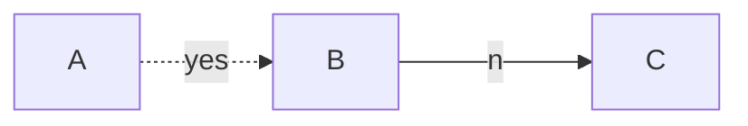

# Mermaid test

* example:

```mermaid
graph LR;
%% this is a comment A -- text --> B{node}
A -.yes.-> B;
B --no--> C;
click A callback "Tooltip"
click B "http://www.github.com" "This is a link"
```
